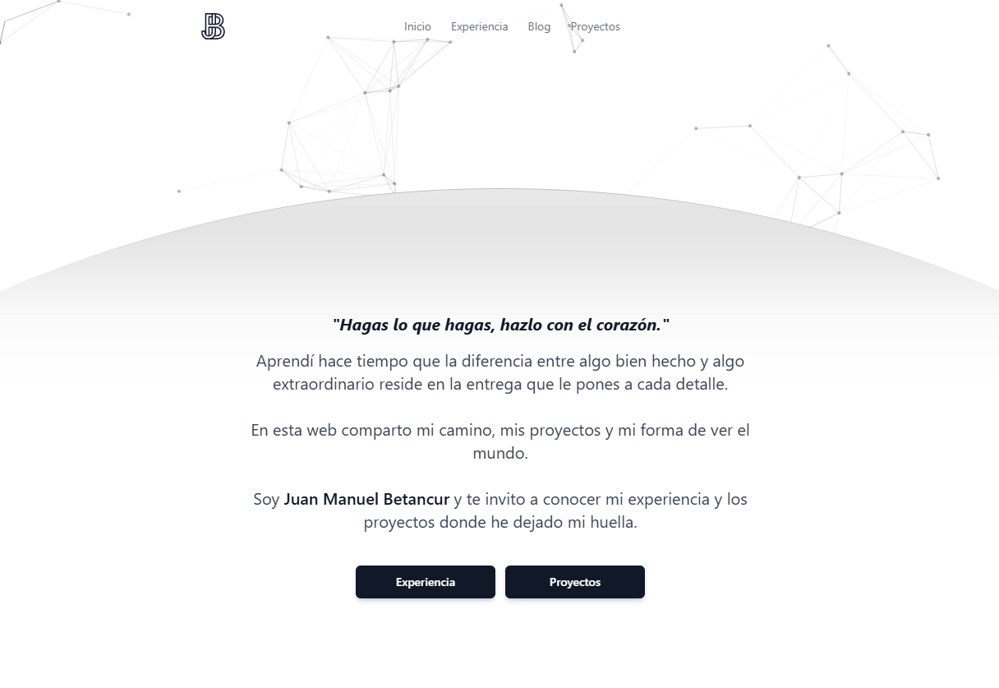

<div align="center">
  
  <h1>juan-betancur.com</h1>
  <p>
    <b>Mi portafolio personal y blog.</b>
    <br />
    <a href="https://juan-betancur.com" target="_blank"><strong>Ver el sitio en vivo »</strong></a>
  </p>
</div>

---

## 📸 Demo




---

## ✨ Tecnologías Utilizadas

Estas son algunas de las tecnologías y herramientas que hacen posible este sitio:

<div align="center">
  <a href="https://astro.build/" target="_blank">
    
  </a>
  <a href="https://tailwindcss.com/" target="_blank">
    
  </a>
  <a href="https://www.typescriptlang.org/" target="_blank">
    
  </a>
    <a href="https://bun.sh/" target="_blank">
    
  </a>
  <a href="https://www.prettier.io/" target="_blank">
    
  </a>
</div>

---

## 📂 Estructura del Proyecto

La estructura del proyecto sigue las convenciones de Astro para mantener el código organizado y escalable.

```
/
├── public/                 # Archivos estáticos (imágenes, fuentes, CNAME)
├── src/
│   ├── assets/             # Recursos como imágenes y SVGs
│   ├── components/         # Componentes reutilizables de Astro
│   ├── content/            # Colecciones de contenido (Markdown/MDX)
│   │   ├── projects/
│   │   └── work/
│   ├── layouts/            # Plantillas de página
│   └── pages/              # Rutas y páginas del sitio
├── astro.config.mjs        # Configuración principal de Astro
├── tailwind.config.cjs     # Configuración de Tailwind CSS
└── package.json            # Dependencias y scripts del proyecto
```

---

## 🚀 Despliegue

El sitio se despliega automáticamente en **GitHub Pages** cada vez que se realiza un `push` a la rama `main`. El proceso está gestionado por un workflow de **GitHub Actions** definido en `.github/workflows/astro.yml`.

Los pasos principales del workflow son:
1.  **Checkout:** Clona el repositorio.
2.  **Setup Bun:** Configura el entorno de Bun.
3.  **Install Dependencies:** Instala las dependencias del proyecto con `bun install`.
4.  **Build:** Compila el sitio de Astro con `bun run build`.
5.  **Deploy:** Despliega el contenido de la carpeta `dist/` a la rama `gh-pages`.

---

## 📫 Contacto

<div align="center">
  <a href="mailto:juanb9410@gmail.com">
    
  </a>
  <a href="https://www.linkedin.com/in/juan-betancurm/">
    
  </a>
  <a href="https://github.com/juan-betancurm">
    
  </a>
</div>